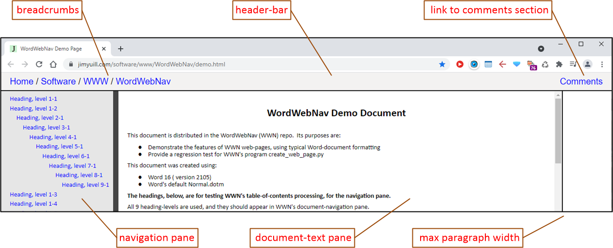
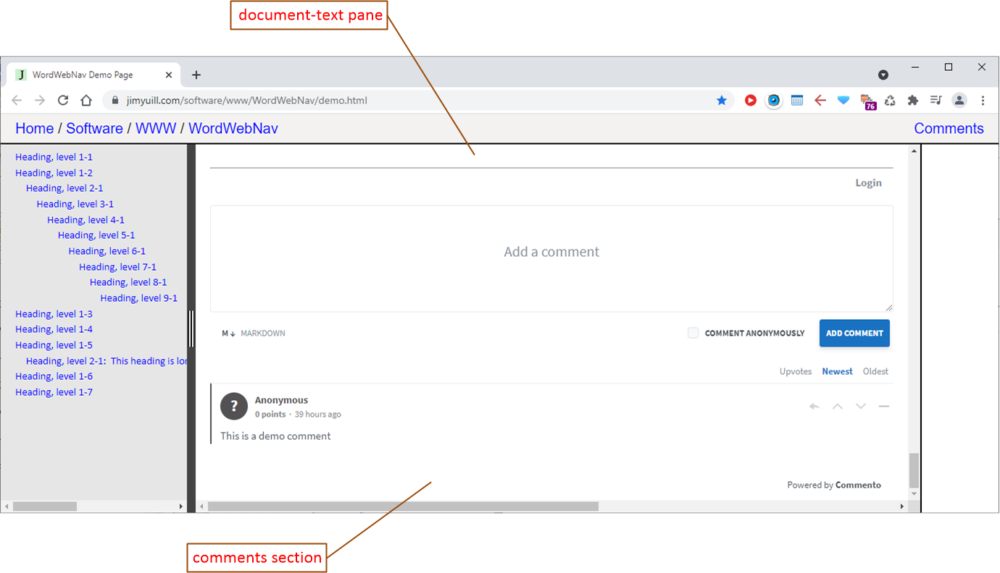

# WordWebNav: create usable MS-Word web-pages

[Link to WWN home-page and docs](https://jimyuill.com/software/www/WordWebNav/)

## **Overview**
WordWebNav (WWN) is an app that converts a Microsoft-Word document to a usable web-page.
WWN is free and open-source.

The present web-page was created from a Word-doc using WWN.

WWN's web-page features are described in the screen-shots below.  The features  include:
- A document-text pane, with adjustable width, and support for user-comments at the bottom
- A navigation pane, with hyperlinks to the headings in the document-text pane
- A header-bar for site-navigation, e.g., breadcrumbs
- Fixes for common bugs in Word's HTML, such as: 
  - Word-HTML's paragraphs span the browser's width, which makes them difficult to read.
  - Word-HTML's multi-level lists are misformatted

## **Screen-shots**
- WWN web-page components:

 
 

- The comments section, at the bottom of the document-text pane (Commento is used here):
 
 

## **Examples**
- [A demo WWN web-page](https://jimyuill.com/software/www/WordWebNav/demo.html) was created from a Word-doc with typical features for recording technical info.
- [The WWN author's web-site](https://jimyuill.com) is created mostly from Word documents and their WWN web-pages.

## **Description**
Word is a powerful tool for recording technical info.  Word can save a document in HTML format, but, for the web-page to be usable, additional features are needed, as well as fixes for bugs in Word's HTML.

WWN can be used to create a personal web-site from Word documents.  The WWN web-pages' user-interface is simple, and it provides the features needed for navigation and user-comments.  And, of course, WWN web-pages can be used on any web-site, not just a personal web-site.

WWN is relatively easy to use.  First, a copy of the Word document is saved in Word HTML-format.  Next, the user creates a parameter-file to specify the WWN web-page's files, header-bar contents, etc.  WWN is then run to generate the WWN web-page.

## **Quality and support**
WWN was created by a software professional, with over 25 years of R&D experience.  Background research was performed to investigate Word's limitations and bugs, and to survey alternative solutions.  The program code is heavily commented, to aid future development.  Extensive testing was performed, including unit and function tests. System-tests were performed using a variety of technical Word-docs, downloaded from the Internet.  The end-user documentation is intended to be complete and easy to use.

WWN's author uses it to construct his personal web-site.  He plans to fix the bugs he finds, and those reported by users, through 2021, and hopefully longer.
- [Report bugs and ideas for improvement](https://github.com/jimyuill/word-web-nav/issues)
- [Contact the WWN author](https://jimyuill.com/about.html)